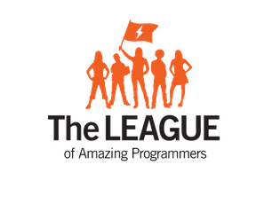

# Level 0

This is the level 0 repository. All recipes here are copied to the students' google drive. 

## Getting Started

Pull this repository and import as an eclipse project. 

### Prerequisites

Eclipse

## Authors

* **June Clark** - *Initial work* - [joonspoon](https://github.com/joonspoon)

See also the list of [teachers](http://www.jointheleague.org/teachers) who participated in this project.

## Acknowledgments

* Thank you to all the amazing teachers at the LEAGUE of Amazing Programmers.

## Todo
  * create modules for recipes.
  * Create Maven or gradle projects for each recipe.
  * setup dependencies.
  * Add Processing recipes and remove the processing recipes that I converted to eclipse.
  

#### Copyright (c) The League of Amazing Programmers 2013-2017
